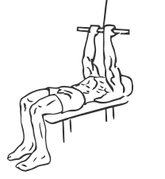
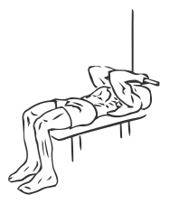

# Lying Close Grip Biceps Curls with Cable

> This exercise combines a flat body position with a pulling motion to work the biceps.

``` 
id: 0233 
type: isolation 
primary: biceps brachii 
secondary:  
equipment: cable 
``` 


## Steps


 - Place a flat bench under a cable weight stack and attach a flat bar to the pulley.
 - Lie down with your head towards the stack and your feet firmly on the floor.
 - Grasp the bar with your palms down, about 8 inches apart, and extend your arms straight up.
 - Curl the bar down in an arc touching your chin.
 - Slowly return to the starting position.

## Tips


## Images





