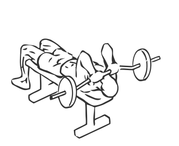
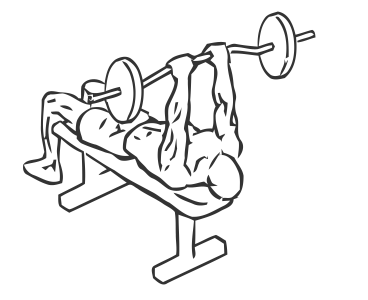

# Lying Close Grip Triceps Press to Chin with Barbell

> This exercise is a classic for building the triceps.

``` 
id: 0180 
type: isolation 
primary: triceps brachii 
secondary:  
equipment: barbell 
``` 


## Steps


 - Lie on a flat bench on your back, with your head at one end.
 - Grasp a bar with a close grip, approximately 6 inches apart.
 - Raise the bar straight up over your shoulders, keeping your elbows close in.
 - Slowly lower the bar in an arc towards your chin.
 - Return the bar to the starting position.

## Tips


## Images





