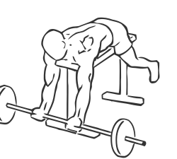
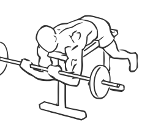

# Lying High Bench Biceps Curl with Barbell

> 

``` 
id: 0234 
type: isolation 
primary: biceps brachii 
secondary:  
equipment: barbell 
``` 


## Steps


 - With this exercise your lay face down to isolate your biceps.
 - Lay face down on a high bench with your head at one end and your toes pressed against the floor to support you.
 - Grasp a barbell with palms facing up, about 12 inches apart.
 - Extending your arms to the floor, curl your arms back towards your head in a slight arc, so your biceps touch your forearm.
 - Slowly return to the starting position.

## Tips


## Images





