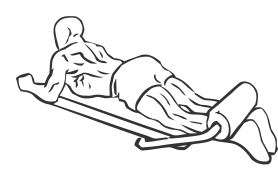
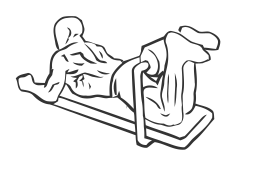

# Lying Leg Curl Machine

> This is an exercise for hamstring strengthening.

``` 
id: 0117 
type: isolation 
primary: ischiocrural muscles 
secondary:  
equipment: machine 
``` 


## Steps


 - Lie face down on a leg curl machine and place your heels under the roller pad.
 - Grasp the grips with your hands for support and slowly curl your ankles up towards your back.
 - Hold for a moment and then return to starting position.
 - Repeat.

## Tips


## Images





