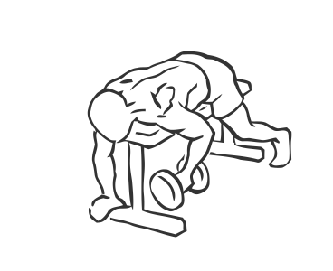
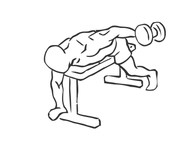

# Lying One Arm Rear Lateral Raise

> This is an exercise for shoulder strengthening.

``` 
id: 0037 
type: isolation 
primary: deltoid 
secondary:  
equipment: dumbbell, flat bench 
``` 


## Steps


 - Lay face down on a flat bench high enough for your arms to hang down to the floor.
 - Place a dumbbell at your side.
 - Your other hand not grasping the dumbbell can be on the floor stabilising your movements.
 - Grasp the dumbbell in your hand and raise your upper arm to shoulder height.
 - Keep your arm straight and perpendicular to your chest with a slight bend in the elbow.
 - In a slow controlled manner lower your arm to starting position.

## Tips


 - Ensure your back is straight throughout this exercise.

## Images





