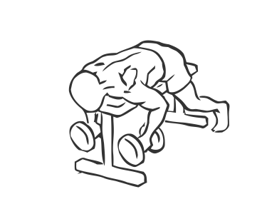
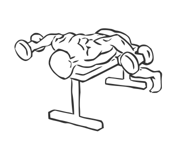

# Lying Rear Lateral Raise

> This is an exercise for shoulder strengthening.

``` 
id: 0023 
type: isolation 
primary: deltoid 
secondary:  
equipment: flat bench, dumbbells 
``` 


## Steps


 - Place the dumbbells at he head of the bench.
 - Lie facedown on a raised bench; raised enough for your arms to move freely beneath the bench.
 - Place your toes on the floor in order to stabilise yourself.
 - Grasp the dumbbells and with a 30 degree bend in your elbows, this is the starting position.
 - Raise your arms to shoulder height, maintaining a controlled motion.
 - Return to starting position and repeat.

## Tips


## Images





