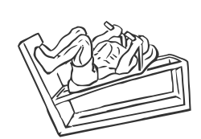
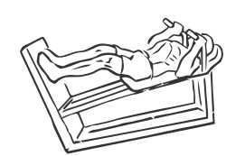

# Lying Squat

> This exercise is similar to a Leg Press Machine working the same muscles.

``` 
id: 0144 
type: compound 
primary: quadriceps 
secondary: gastrocnemius,soleus,ischiocrural muscles 
equipment: machine 
``` 


## Steps


 - Adjust the shoulder rack of the machine so that your feet comfortably reach the crosspiece with a slight bend in your knees.
 - To begin, press your feet forward and release the safety locks.
 - Slowly lower the weight towards your body, keeping your abs drawn in and your knees moving in the same direction as your feet to a 90 degree angle.
 - Do not lock your knees or bounce the weight.

## Tips


## Images





