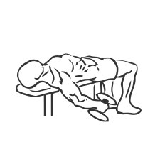
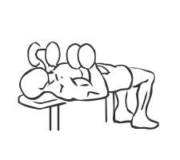

# Lying Supine Biceps Curl with Dumbbell

> This is an advanced biceps exercise where you lay down to isolate the muscles you are working.

``` 
id: 0235 
type: isolation 
primary: biceps brachii 
secondary:  
equipment: dumbbell 
``` 


## Steps


 - This is another biceps exercise where you lay down to isolate the muscles you are working. This is an advanced exercise.
 - Lie on a flat bench with your head at one end and your feet planted firmly on the floor.
 - With a dumbbell in each hand, palms facing in, bring your arms down to your sides, hanging off the bench.
 - Slowly raise your arms up until they are level with your chest.
 - Curl the dumbbells by twisting your palms, so that your forearms touch your biceps.
 - Slowly lower your arms to the starting position.
 - Note: Practice the motions of this exercise with light weights to become familiar with the movements.

## Tips


## Images





