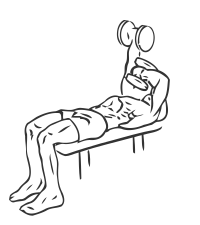
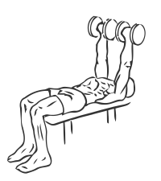

# Triceps Extension: Dumbbell (Lying, Across Face)

> This is an advanced Triceps exercise and should be avoided by beginners.

``` 
id: 0182 
type: isolation 
primary: triceps brachii 
secondary:  
equipment: dumbbell 
``` 


## Steps


 - This is an advanced exercise and should be avoided by beginners.
 - Lay on a flat bench with your head at one end and your feet planted firmly on the floor.
 - Grasp a dumbbell in each hand with palms facing up.
 - Raise dumbbells over your body. Your arms will be pointed towards the ceiling.
 - While keeping your upper arms and elbows still, lower the dumbbell slowly over your face bending only your elbow.
 - Slowly raise the dumbbell back to the starting position and repeat with your other arm.
 - Note: Do not perform this exercise if your arms are fatigued, as you are lifting the weight over your face.

## Tips


## Images





