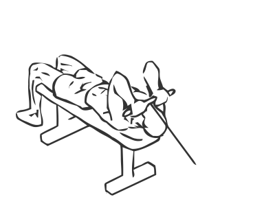
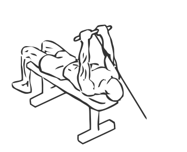

# Lying Tricep Extension with Cable

> This exercise uses cables to isolate and work the triceps.

``` 
id: 0165 
type: isolation 
primary: triceps brachii 
secondary:  
equipment: cable 
``` 


## Steps


 - This exercise uses cables to isolate and work the triceps (muscles on the back of the arms).
 - Place a flat bench with the end towards a weight stack.
 - Attach a short straight bar to the pulley and lower the pulley to the bottom of the stack.
 - Lie face up on the bench and grasp the bar with a narrow overhand grip.
 - Starting with your arms extended lower the bar towards the bar towards the stack by bending your elbows.
 - Slowly extend your arms upright and return to the starting position.
 - Note: Keep your elbows level throughout the exercises.

## Tips


## Images





