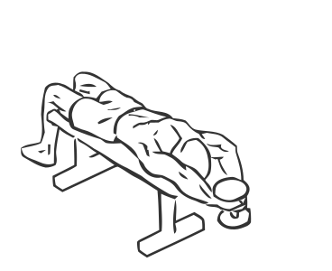
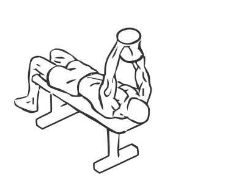

# Triceps Extension: Dumbbell (Lying)

> This exercise uses gravity to increase the resistance of the weight.

``` 
id: 0181 
type: isolation 
primary: triceps brachii 
secondary:  
equipment: dumbbell 
``` 


## Steps


 - Lay on a flat bench with your head at one end and your feet planted firmly on the floor.
 - Grasp a dumbbell with both hands with palms facing up.
 - Raise dumbbell over your body. Your arms will be pointed towards the ceiling.
 - While keeping your upper arms and elbows still, lower the dumbbell in an arc behind your head.
 - Slowly raise the dumbbell back to the starting position.

## Tips


## Images





