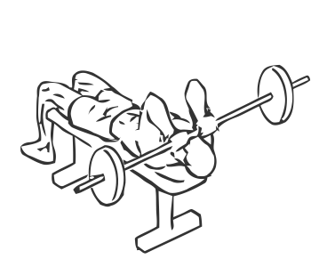
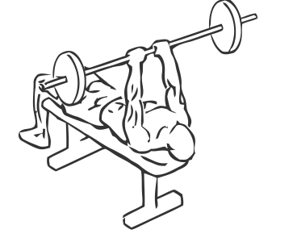

# Lying Triceps Press with Barbell

> This is another classic exercise for building the triceps.

``` 
id: 0183 
type: isolation 
primary: triceps brachii 
secondary: pectoralis major 
equipment: barbell 
``` 


## Steps


 - Lie on a flat bench with your head at one end.
 - Grasp an EZ or Curl bar with an overhand grip.
 - Raise the bar straight up over your shoulders, taking care to keep your elbows in close.
 - Slowly lower the bar in an arc over your head.
 - Return the bar to the starting position.
 - Note: Keep your arms straight throughout this exercise moving only your elbows.

## Tips


## Images





