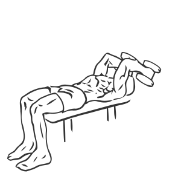
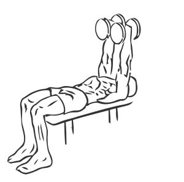

# Triceps Extension: Dumbbell (Lying Two Arm)

> This a lying version of a Triceps Kickback.

``` 
id: 0184 
type: isolation 
primary: triceps brachii 
secondary:  
equipment: dumbbell 
``` 


## Steps


 - Lie flat on a bench, on your back, with your head at one end.
 - Grasp a dumbbell in each hand and raise them at arms length over your shoulders.
 - Lower the dumbbells in an arc bending your elbows until your forearms are touching your biceps.
 - Slowly return to the starting position.

## Tips


## Images





