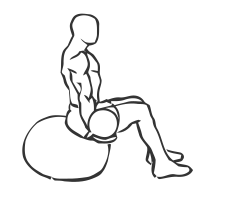
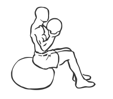

# Medicine Ball Biceps Curl on Stability Ball

> This exercise combines a new technology, Stability Ball, with a old piece of fitness equipment, the Medicine Ball.

``` 
id: 0267 
type: isolation 
primary: biceps brachii 
secondary: core,forearm 
equipment: medicine ball 
``` 


## Steps


 - Sit on a Stability Ball with your feet firmly on the floor in front of you.
 - Sit with your back straight, your shoulders back and your abs drawn in.
 - Hold a Medicine Ball in one hand and curl it up bringing your forearm up to your bicep.
 - Return to starting position and switch arms.
 - Note: Grasp the Medicine Ball with your fingers spread wide to balance the ball.

## Tips


## Images





