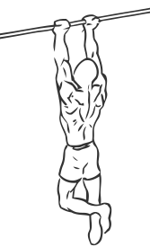
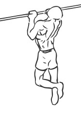

# Narrow Parallel Grip Chin-ups

> This is an exercise similar to the regular Chin Up but focuses more on shoulder strengthening.

``` 
id: 0090 
type: isolation 
primary: deltoid,latissimus dorsi 
secondary: back,core 
equipment: bar, body 
``` 


## Steps


 - Grasp the bar with an supinated (overhand) grip so that your palms are facing.
 - Let your body hang from the bar with your arms straight.
 - Slowly pull yourself up so that your chin is higher than the bar.
 - With a controlled movement lower yourself to the starting position.
 - Repeat

## Tips


 - Ensure that your body remains in one line throughout this exercise.

## Images





