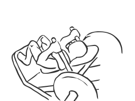
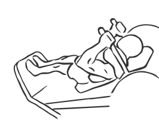

# Narrow Stance Hack Squats

> Like the Hack Squat, this exercise works the muscles of the leg.

``` 
id: 0145 
type: compound 
primary: quadriceps 
secondary: ischiocrural muscles,gastrocnemius,soleus 
equipment: machine 
``` 


## Steps


 - Like the Hack Squat, this exercise works the muscles of the leg. The narrow stance targets the external muscles more efficiently.
 - Lie face up on a Hack Squat machine with your shoulders against the pad.
 - Place your feet facing forward at a distance of 6 inches apart with your toes point slightly outward.
 - Release the dock levers and place your hands on the handgrips.
 - Drawing your abs in, extend your body standing upright.
 - Lower your body to a squatting position so your knees are bent as if you were sitting down.
 - Return to the starting position.

## Tips


## Images





