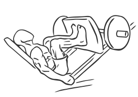
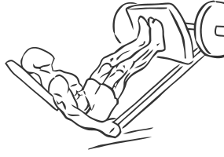

# Narrow Stance Leg Press

> This is a variation of the leg press which targets more of the external muscles of the legs.

``` 
id: 0143 
type: compound 
primary: quadriceps 
secondary: gastrocnemius,soleus,ischiocrural muscles 
equipment: machine 
``` 


## Steps


 - This is a variation of the leg press which targets more of the external muscles of the legs by moving your feet closer together.
 - Sit on a leg press machine with your feet on the crosspiece 6 inches apart, with your toes pointed slightly outward.
 - Grasp the handles on the side of the machine and release the locks.
 - Keeping your abs drawn in, bend your knees and bring the weight as far as possible towards your chest.
 - Hold this position for a moment and then slowly return the weight to starting position.
 - Note: Do not lock your knees at the top.

## Tips


## Images





