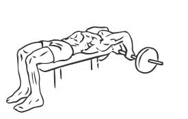
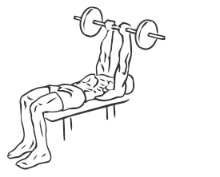

# Old School Reverse Extensions

> As the name suggests, this is an old classic exercise that hits the triceps hard.

``` 
id: 0185 
type: isolation 
primary: triceps brachii 
secondary:  
equipment: barbell 
``` 


## Steps


 - Lie down on a bench, on your back, with your head at one end.
 - Grasp a barbell with an underhand grip.
 - Move your arms beyond your head, keeping them in a straight line.
 - Bending only your elbows, slowly lower and raise the barbell.

## Tips


## Images





