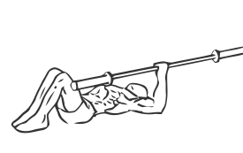
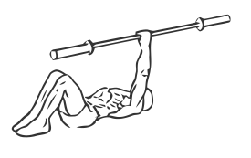

# One Arm Barbell Floor Press

> This is an exercise for chest and triceps strengthening.

``` 
id: 0070 
type: isolation 
primary: pectoralis major 
secondary: triceps brachii 
equipment: barbell 
``` 


## Steps


 - Lie flat on your back with your knees bent and your feet firmly on the floor.
 - Draw in your abs and contract your lats, and glutes.
 - Have your partner hand you the bar and with your bicep parallel to the floor lift and extend your arm fully so it is straight.
 - Return to the starting position.
 - Complete reps and switch arms.

## Tips


## Images





