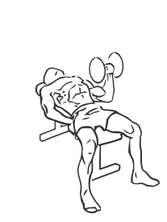
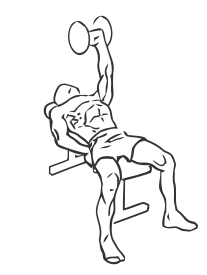

# Bench Press: Dumbbell (One Arm)

> This is an advanced strengthening exercise for the chest and rotator cuff muscles of the shoulder.

``` 
id: 0068 
type: isolation 
primary: pectoralis major 
secondary: triceps brachii,deltoid 
equipment: flat bench, dumbbell 
``` 


## Steps


 - Lie flat on a bench with your feet placed firmly on the floor and your abs drawn in.
 - Grasp the dumbbell in one hand and bring it up to the side of your chest, this is starting position.
 - Extend your arm, pressing the dumbbell up till your arm is straight and your elbow locked.
 - Using slow controlled movements, lower the weight to starting position.
 - Switch arms after completing reps with one arm.
 - Repeat.

## Tips


 - Ensure your hips and back remain in contact with the bench at all times during this exercise.
 - Start with a lighter weight in order to perfect the exercise technique and then when progressing onto a heavier weight you should be spotted to ensure safety and injury prevention.

## Images





