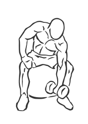
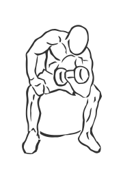

# One Arm Bicep Concentration on Stability Ball with Dumbbell

> This exercise uses a Stability Ball instead of a bench for better form.

``` 
id: 0258 
type: isolation 
primary: biceps brachii 
secondary: forearm 
equipment: dumbbell 
``` 


## Steps


 - Grasp a dumbbell in one hand and sit on a Stability Ball with your feet wide apart.
 - Bend forward leaning at the waist.
 - With the dumbbell in your hand, place your elbow against your knee.
 - Lower your arm so it is flat against your calves.
 - Curl your arm up to your chest keeping your elbow steady.
 - Return to starting position and change hands.

## Tips


## Images





