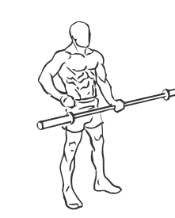
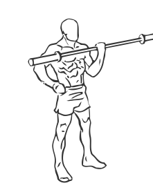

# One Arm Bicep Curl with Olympic Bar or Barbell

> This is an advanced exercise for building stability and the muscles of the arms.

``` 
id: 0254 
type: isolation 
primary: biceps brachii 
secondary: forearm 
equipment: barbell 
``` 


## Steps


 - Stand with your feet shoulder width apart and your knees slightly bent.
 - Grasp an Olympic bar (empty weight bar) in the middle with one hand so that the bar is equally balanced.
 - Keep your free hand at your side for support.
 - Curl the bar up so your forearm touches your bicep.
 - Slowly lower the bar and change arms.
 - Note: If an Olympic bar is too heavy use a lighter weight barbell.

## Tips


## Images





