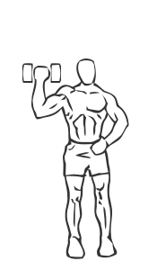
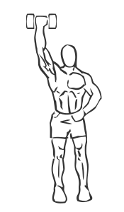

# One Arm Dumbbell Shoulder Press

> This is an exercise for shoulder strengthening.

``` 
id: 0038 
type: isolation 
primary: deltoid 
secondary: triceps brachii,biceps brachii 
equipment: dumbbell 
``` 


## Steps


 - Stand with your feet shoulder width apart, back straight and abs drawn in.
 - Grasp a dumbbell in your hand and lift it with a bent elbow to your shoulder height to start.
 - Lift the dumbbell straight up till your arm is fully extended overhead.
 - Lower in a controlled manner and return to starting position.
 - Repeat.

## Tips


## Images





