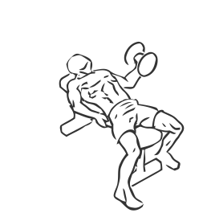
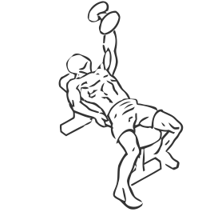

# One Arm Flat Bench Fly’s

> This is an exercise for chest strengthening.

``` 
id: 0071 
type: isolation 
primary: pectoralis major 
secondary:  
equipment: flat bench, dumbbell 
``` 


## Steps


 - Lie on a flat bench with your free hand holding the bench.
 - Grasp the dumbbell in your other hand and with your forearm parallel to the floor raise your arm in an arc the middle of your chest.
 - Once the dumbbell is at the middle of your chest line, slowly lower is along the same path to starting position.
 - Repeat.

## Tips


## Images





