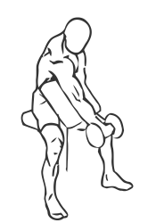
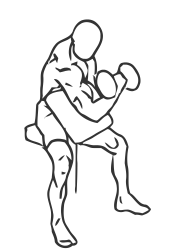

# Preacher Curl: Dumbbell (One Arm)

> 

``` 
id: 0237 
type: isolation 
primary: biceps brachii 
secondary: forearm 
equipment: dumbbell 
``` 


## Steps


 - A Preacher Curl uses a special bench to support the triceps and isolate the biceps to build the arms. This version uses dumbbells and single arm movements for better control.
 - Adjust the seat of the bench so your arm is level with the top of the bench.
 - Grasp a dumbbell in your hand with palms facing up.
 - Rest your arm against the bench and extend it fully down.
 - Keeping your arm on the bench at all times, curl the dumbbell up towards your head.
 - Pause for a moment and then lower the dumbbell back to starting position.
 - Switch arms and repeat.
 - Note: Perform this exercise in a slow controlled manner for best results.

## Tips


## Images





