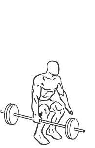
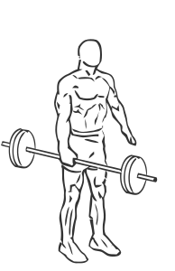

# Dead Lift: Barbell (One Arm Side)

> This is an advanced exercise that works most of the muscles of the body.

``` 
id: 0150 
type: compound 
primary: quadriceps 
secondary: abdominals,glutaeus maximus,gastrocnemius,soleus,ischiocrural muscles 
equipment: barbell 
``` 


## Steps


 - This is an advanced exercise that works most of the muscles of the body. Exercises like this are used to develop functional strength for sports that require strong hands.
 - Stand besides a barbell placed on the floor.
 - Grasp the bar with an overhand grip in the center.
 - Crouching down as if your were performing a squat, bend down so your thighs are parallel with the floor.
 - Extend your legs slowly as you straighten your body up, drawing in your abs as you rise.
 - Note: Perform this exercise with an empty bar to become familiar with the movement before adding weights.

## Tips


## Images





