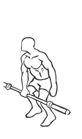
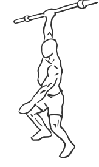

# One Arm Snatch with Barbell

> This is an advanced exercise that works most of the muscles of the body.

``` 
id: 0148 
type: compound 
primary: quadriceps 
secondary: deltoid,ischiocrural muscles,erector spinae,abdominals,trapezius,gastrocnemius,soleus 
equipment: barbell 
``` 


## Steps


 - This is an advanced exercise that works most of the muscles of the body.
 - Exercises like this are used to develop functional strength for sports that require strong hands.
 - Stand with your feet shoulder width apart, and a slight bend in your knees.
 - Grasp the bar with an overhead grip.
 - Starting with the barbell held slightly above the knees (hang position), lift the weight up over your head (step 1) then back to shoulder height (step 2) and finally back to starting position between near your knees.

## Tips


 - Note: Bend your knees as you lift and lower the weight to help control the movement.

## Images





