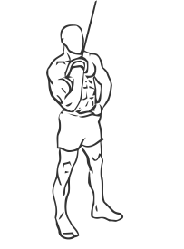
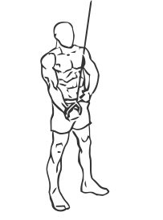

# One Arm Tricep Extension with Cable

> This exercise isolates the triceps muscles individually.

``` 
id: 0166 
type: isolation 
primary: triceps brachii 
secondary:  
equipment: cable 
``` 


## Steps


 - Place a cable pulley on the highest setting and adjust a stirrup handle to the pulley.
 - Stand facing the weight stack and grasp the handle with and underhand grip.
 - Keep your back straight, your abs drawn in and your knees slightly bent.
 - Starting at the top, push your arm down until it is straight, feeling the concentration in your tricep.
 - Slowly return to starting position.
 - Tips: Keep your elbow close to your side while performing this exercise.

## Tips


## Images





