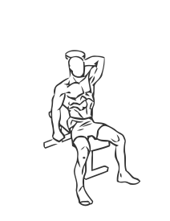
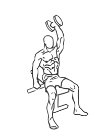

# Triceps Extension: Dumbbell (One Arm)

> This exercise uses a dumbbell to work each arm individually.

``` 
id: 0173 
type: isolation 
primary: triceps brachii 
secondary:  
equipment: dumbbell 
``` 


## Steps


 - Sit on a bench with your back straight and your abs drawn in.
 - Grasp a dumbbell in your hand and place it behind your neck with your elbow bent.
 - Slowly extend your arm straight up over your head and slowly return to the starting position.
 - Note: Place your free hand across your chest to help steady yourself during this exercise.

## Tips


## Images





