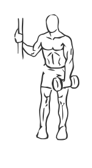
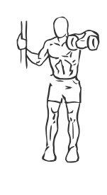

# Upright Row: Dumbbell (One Arm)

> This is an exercise for shoulder and trapezius strengthening.

``` 
id: 0039 
type: isolation 
primary: deltoid 
secondary: trapezius 
equipment: dumbbell 
``` 


## Steps


 - Stand near a post or other stable tall object. With your one hand, hold the post.
 - Grasp the dumbbell in your other hand with a pronated grip (palms facing backwards).
 - Place the dumbbell in front of your thigh, this is starting position.
 - Lift the dumbbell upward to your shoulder with your elbow pointing away from your body in a rowing motion.
 - Lower your arm to starting position and repeat.

## Tips


## Images





