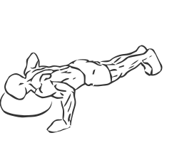
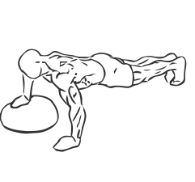

# One Armed Biased Push Up

> This is an exercise for chest strengthening but also strengthens ones core, shoulders, biceps and triceps.

``` 
id: 0072 
type: isolation 
primary: pectoralis major 
secondary: triceps brachii,bicpes,deltoid,core 
equipment: bosu ball 
``` 


## Steps


 - Arrange the ball so that as you begin the exercise, one hand on the Bosu ball and the other on the floor.
 - Place the ball flat side down on the floor.
 - Kneel on the floor with your arms fully extended on the dome, and body straight.
 - Keeping your abs drawn in and your body straight, lower your chest to the ball.
 - Pause for a moment and then return to starting position.
 - Repeat.

## Tips


## Images





