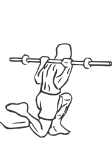
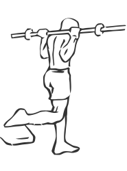

# One Leg Squat with Barbell

> The One Leg Squat isolates the muscles of the leg for optimal exercise.

``` 
id: 0147 
type: compound 
primary: quadriceps 
secondary: gastrocnemius,soleus,ischiocrural muscles,glutaeus maximus 
equipment: barbell 
``` 


## Steps


 - The One Leg Squat isolates the muscles of the leg for optimal exercise. This exercise is also used to build or rebuild strength after injury.
 - Place a bench or box 12-18 inches tall behind you. The taller the box the greater the difficulty of the exercise.
 - Lifting a barbell off of a weight rack, position it on your shoulders.
 - Place one foot up on the bench, and your other foot firmly on the floor 2-3 feet in front you.
 - Drawing your abs in descend slowly by bending your front knee and hip as if you are sitting down (squatting).
 - Lower yourself as far as you can control without letting your body shift towards your toe (this will cause you to loose balance).
 - Pause in the downward position and slowly return upright to the starting position.
 - Switch legs and repeat.
 - Notes: A pad on the bar or towel on your shoulders can help improve your grip and reduce the discomfort of the bar against your back. Practice the squat without any weight to allow yourself to become comfortable with the movements.

## Tips


## Images





