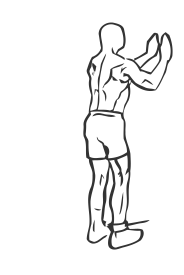
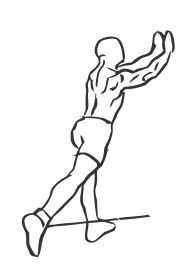

# One Legged Cable Kickback

> This is an exercise for gluts and hamstring strengthening.

``` 
id: 0112 
type: isolation 
primary: glutaeus maximus 
secondary: ischiocrural muscles 
equipment: cable 
``` 


## Steps


 - Standing at a cable tower attach an ankle cuff to a low pulley.
 - Facing the weight stack, with a slight bend in your knees and your abs drawn in
 - Slowly kick your ankle back in and arc as high as you are able to.
 - Return to starting position and switch ankles.

## Tips


## Images





