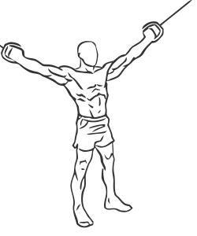
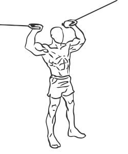

# Overhead Curl with Cable

> By using cable, this exercise isolates and defines the biceps muscles.

``` 
id: 0238 
type: isolation 
primary: biceps brachii 
secondary:  
equipment: cable 
``` 


## Steps


 - By using cable this exercise isolates and defines the biceps (arm) muscles.
 - Attach a stirrup handle to each side of a high pulley on a cable machine.
 - Grasp the handles with palms facing up and stand with your feet shoulder width apart.
 - Extend your arms fully to each side.
 - Keeping your elbows steady, curl your wrists towards the sides of your head.
 - Contract your biceps and pause for a moment.
 - Then return to the starting position.

## Tips


## Images





