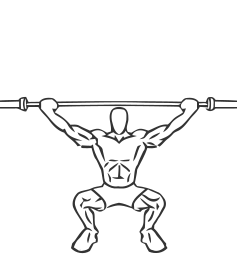
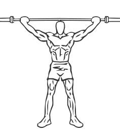

# Overhead Squat with Barbell

> In this version of the squat you hold the bar overhead as you perform the exercise.

``` 
id: 0151 
type: compound 
primary: quadriceps 
secondary: glutaeus maximus,gastrocnemius,soleus,ischiocrural muscles,deltoid,erector spinae 
equipment: barbell 
``` 


## Steps


 - Stand with your feet a bit wider than shoulder width apart with your toes pointed slightly outward.
 - Grasp a barbell using a wide side snatch grip with your arms and elbows fully extended.
 - Keeping the bar overhead, bend your knees and lower your body until your thighs are parallel with the floor.
 - Return to starting position.
 - Notes: Keep your feet firmly planted on the floor throughout this exercise. Keep your abs drawn in your back tight and your chest up you perform this exercise.

## Tips


## Images





