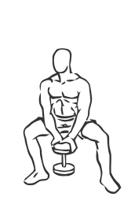

# Pile Squat with Dumbbell

> This version of the squat is done with a dumbbell and mimics the action of a pile driver.

``` 
id: 0152 
type: compound 
primary: quadriceps 
secondary: ischiocrural muscles,gastrocnemius,soleus 
equipment: dumbbell 
``` 


## Steps


 - Stand with your feet 2-4 inches wider than your shoulders, with your toes pointed out at a 45 degree angle.
 - Grasp a dumbbell with both hands in the center of your body.
 - Keep your knees slightly bent and your back straight.
 - Squat down as if you were going to sit in a chair, bringing your thighs parallel to the floor.
 - With a controlled motion return to starting position.
 - Notes: Keep your feet planted firmly on the floor throughout this exercise.

## Tips


## Images




