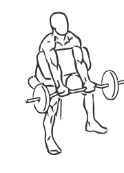
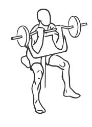

# Preacher Curl: Barbell

> A Preacher Curl uses a special bench to support the triceps and isolate the biceps to build the arms.

``` 
id: 0239 
type: isolation 
primary: biceps brachii 
secondary: forearm 
equipment: barbell 
``` 


## Steps


 - &nbsp;
 - Adjust the seat of the bench so that your arms are level with the top of the bench.
 - Grasp the bar with palms facing up, shoulder width apart.
 - Picking up the bar, rest your arms against the bench and extend them fully.
 - Keeping your arms on the bench at all times, curl the bar up towards your head.
 - Pause for a moment and then lower the bar back to starting position.
 - Note: Perform this exercise in a slow controlled manner for best results.

## Tips


## Images





