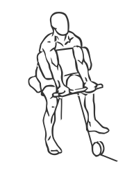
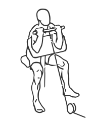

# Preacher Curl: Cable

> A Preacher Curl uses a special bench to support the triceps and isolate the biceps to build the arms.

``` 
id: 0217 
type: isolation 
primary: biceps brachii 
secondary: forearm 
equipment: cable 
``` 


## Steps


 - Place a padded arm curl bench in front of a cable machine.
 - Attach a short bar to the bottom pulley.
 - Rest your arms against the bench and extend them fully.
 - With a narrow grip (6 inches) grasp the bar with palms facing up and pull it towards your head.
 - Pause for a moment and then lower the bar back to starting position.
 - Note: Perform this exercise in a slow controlled manner for best results.

## Tips


## Images





