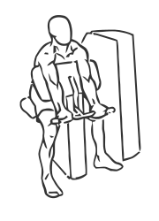
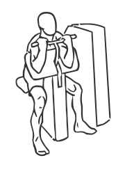

# Preacher Curl: Machine

> A Preacher Curl uses a special bench to support the triceps and isolate the biceps to build the arms.

``` 
id: 0236 
type: isolation 
primary: biceps brachii 
secondary: forearm 
equipment: machine 
``` 


## Steps


 - A Preacher Curl uses a special bench to support the triceps and isolate the biceps to build the arms. This version of the exercises is a machine exercise. This is a good exercise for beginners.
 - Adjust the seat of the bench so your arms are level with the top of the bench. Rest your arms against the bench and extend them fully. Grasp the bar underhand (palms facing up) and pull it towards your head. Pause for a moment and then lower the bar back to starting position.
 - Note: Perform this exercise in a slow controlled manner for best results. Read the instructions on the machine before performing this exercise.

## Tips


## Images





