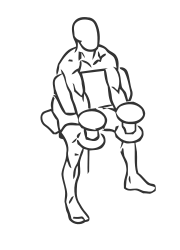
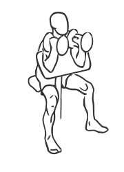

# Preacher Curl: Dumbbell (Hammer)

> This exercise combines a Hammer Curl with a Preacher bench.

``` 
id: 0240 
type: isolation 
primary: biceps brachii 
secondary:  
equipment: dumbbell 
``` 


## Steps


 - Adjust the seat of the bench so that your arms are level with the top of the bench.
 - Grasp a dumbbell in each hand with your palms facing each other, shoulder width apart and extend your arms fully along the bench.
 - Keeping your arms and elbows on the bench at all times, curl the dumbbells up towards your head.
 - Pause for a moment and then lower the bar back to starting position.
 - Note: Perform this exercise in a slow controlled manner for best results.

## Tips


## Images





