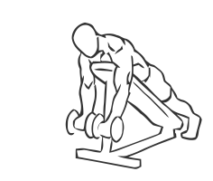
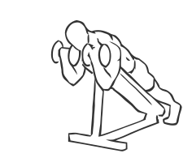

# Prone Incline Biceps Curl with Dumbbell

> This exercise uses an incline bench to change your body’s position as you perform Biceps Curls.

``` 
id: 0225 
type: isolation 
primary: biceps brachii 
secondary:  
equipment: dumbbell 
``` 


## Steps


 - This exercise uses an incline bench to change your body’s position as you perform Biceps Curls. The movement is very similar to a Preacher Curl.
 - Adjust an incline bench to a 45 degree angle.
 - Grasp dumbbells in each hand and lean face down against the bench, with your feet resting on the floor for support.
 - Allow your arms to hang down at your sides.
 - Keeping your elbow straight, raise the dumbbells up towards your head, contracting your biceps.
 - In a controlled manner, lower the weight and repeat.
 - Note: Practice steady movements in this exercise, be careful not to let your arms sway.

## Tips


## Images





