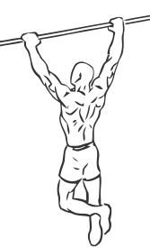
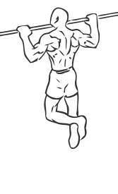

# Pull Ups

> This is an exercise in lats, biceps and middle back strengthening.

``` 
id: 0087 
type: isolation 
primary: latissimus dorsi 
secondary: biceps brachii 
equipment: bar 
``` 


## Steps


 - Grab the pull-up bar with the palms facing forward using the prescribed grip.
 - As you have both arms extended in front of you holding the bar at the chosen grip width, bring your torso back around 30 degrees or so while creating a curvature on your lower back and sticking your chest out. This is your starting position.
 - Pull your torso up until the bar touches your upper chest by drawing the shoulders and the upper arms down and back. Exhale as you perform this portion of the movement.
 - After a second on the contracted position, start to inhale and slowly lower your torso back to the starting position when your arms are fully extended and the lats are fully stretched.
 - Repeat this motion.
 - <h3> Tip</h3>
 - Concentrate on squeezing the back muscles once you reach the full contracted position. The upper torso should remain stationary as it moves through space and only the arms should move. The forearms should do no other work other than hold the bar.

## Tips


## Images





