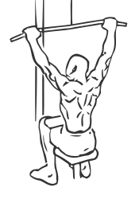
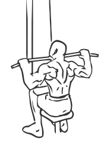

# Pullover On Stability Ball With Weight

> This is an exercise for back, shoulders and neck strengthening.

``` 
id: 0098 
type: isolation 
primary: deltoid 
secondary: back,trapezius 
equipment: exercise ball, dumbbell 
``` 


## Steps


 - Grasp a Barbell or Dumbbell and sit on a Ball with your feet firmly placed on the floor.
 - Lower your body so your upper abs are the only part of your body supported on the Ball.
 - Bring the Barbell or Dumbbell to your chest with your arms extend.
 - In an arcing motion raise the Barbell or Dumbbell over and behind your head towards the floor.
 - Return to starting position.
 - Repeat.

## Tips


## Images





