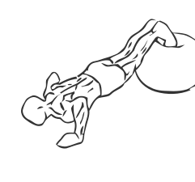
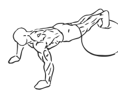

# Push Up: Exercise ball

> This is similar to the standard Push Up except using an Exercise Ball forces you to engage the muscle of your core (Rectus Abdominis, Transverse Abdominis, and the Obliques).

``` 
id: 0076 
type: isolation 
primary: pectoralis major 
secondary: triceps brachii,deltoid 
equipment: body, exercise ball 
``` 


## Steps


 - Place your feet and shins flat on an Exercise Ball.
 - Place your arms in front of you at shoulder width apart, place your hands under your arms and press up from the ground until your arms are fully extended.
 - Pause at the top for a moment and steady your balance.
 - Slowly return to the starting position with your chest lowered towards the ground.

## Tips


## Images





