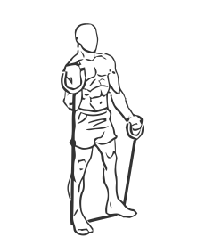
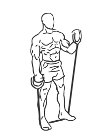

# Quick Alternating Biceps Curls with Band

> This exercise uses a bungy or exercise band for resistance.

``` 
id: 0261 
type: isolation 
primary: biceps brachii 
secondary: triceps brachii 
equipment: exercise band 
``` 


## Steps


 - Place a bungy under your feet and hold the handles palms forward in your hands.
 - Stand with your feet shoulder width apart, knees slightly bent and your abs drawn in.
 - Curl your arms up and down in an alternating motion, keeping your body straight.
 - As you become comfortable with the motion, increase your speed.
 - Note: Contract your biceps as you curl your arms up.

## Tips


## Images





