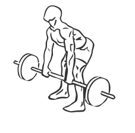
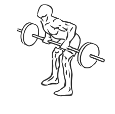

# Rear Deltoid Row Barbell

> This is an exercise for shoulder and biceps strengthening.

``` 
id: 0028 
type: isolation 
primary: deltoid 
secondary: biceps brachii 
equipment: barbell 
``` 


## Steps


 - Place a barbell on the floor in front of you with the resided weights attached.
 - With your knees bent and back straight grasp the bar with a wide overhand grip (palms facing downwards).
 - Keep your chest steady and your arms perpendicular to your chest.
 - Pull the bar as far up to your chest as you can.
 - Hold for a moment than lower the bar in a controlled manner.
 - Repeat.

## Tips


## Images





