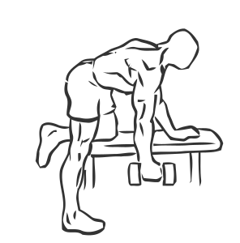
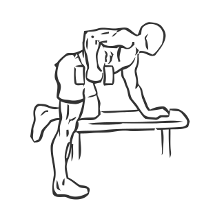

# Rear Deltoid Row Dumbbell

> This is an exercise for deltoid, biceps and trapezius strengthening.

``` 
id: 0024 
type: isolation 
primary: deltoid 
secondary: biceps brachii,trapezius 
equipment: dumbbell 
``` 


## Steps


 - Place your right foot on the floor, rest your left knee and hand on a flat bench.
 - Lean forward so your body’s weight is supported by your left arm and knee.
 - Keeping your back flat, reach down and pick up the dumbbell with your right hand.
 - Raise your right arm as close to your chest as possible; while bending and bringing your elbow back as far as you can.
 - Pause at the top for a moment and then lower the dumbbell in a controlled manner to the starting position.
 - Switch arms by doing the opposite positioning.
 - Repeat.

## Tips


 - maintain a good posture at all times throughout the exercise.

## Images





