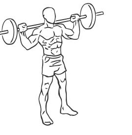
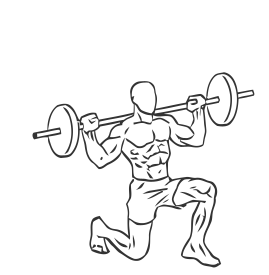

# Lunges: Barbell (Rear)

> This is an advanced version of a lunge.

``` 
id: 0128 
type: compound 
primary: quadriceps 
secondary: hip abductors,gastrocnemius,soleus,glutaeus maximus,ischiocrural muscles 
equipment: barbell 
``` 


## Steps


 - Place a barbell on a rack at chest height.
 - Lift the barbell of of the rack and onto your shoulders, gripping the bar slightly wider than shoulder width apart.
 - Stand with your feet approximately 8 inches apart with your toes pointing forward.
 - Slowly take a step backward with your right leg.
 - Keeping your abs drawn in and your upper body straight, lower your body until your left knee is almost on the ground. You may choose to place a mat or towel under your knee.
 - Hold for a moment and then return to starting position.

## Tips


## Images





