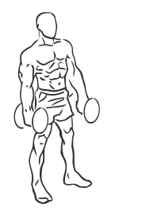
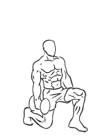

# Lunges: Dumbbell (Rear)

> This is an advanced version of a lunge using a dumbbell.

``` 
id: 0129 
type: compound 
primary: quadriceps 
secondary: gastrocnemius,soleus,ischiocrural muscles,glutaeus maximus,hip abductors 
equipment: dumbbells 
``` 


## Steps


 - This is an advanced version of a lunge.
 - Grasp a dumbbell in each hand.
 - Stand with your feet approximately 8 inches apart with your toes pointing forward.
 - Slowly take a step backward with your right leg.
 - Keeping your abs drawn in and your upper body straight, lower your body until your left knee is almost on the ground. You may choose to place a mat or towel under your knee.
 - Hold for a moment and then return to starting position.

## Tips


## Images





