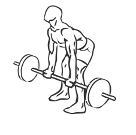
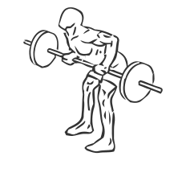

# Reverse Grips Bent Over Barbell Rows

> This is an exercise for middle back and biceps strengthening.

``` 
id: 0026 
type: isolation 
primary: latissimus dorsi 
secondary: biceps brachii 
equipment: barbell 
``` 


## Steps


 - Bend over a barbell at slight angle with your knees bent and your back straight.
 - Grasp the bar with a reverse grip (palms facing up) and slowly pull the barbell to your abs, keeping your elbows close to your sides.
 - Pause for a moment at the top.
 - Return the barbell to the starting position.
 - Repeat.

## Tips


 - Ensure that the weight of the barbell is evenly distributed through both hands.

## Images





